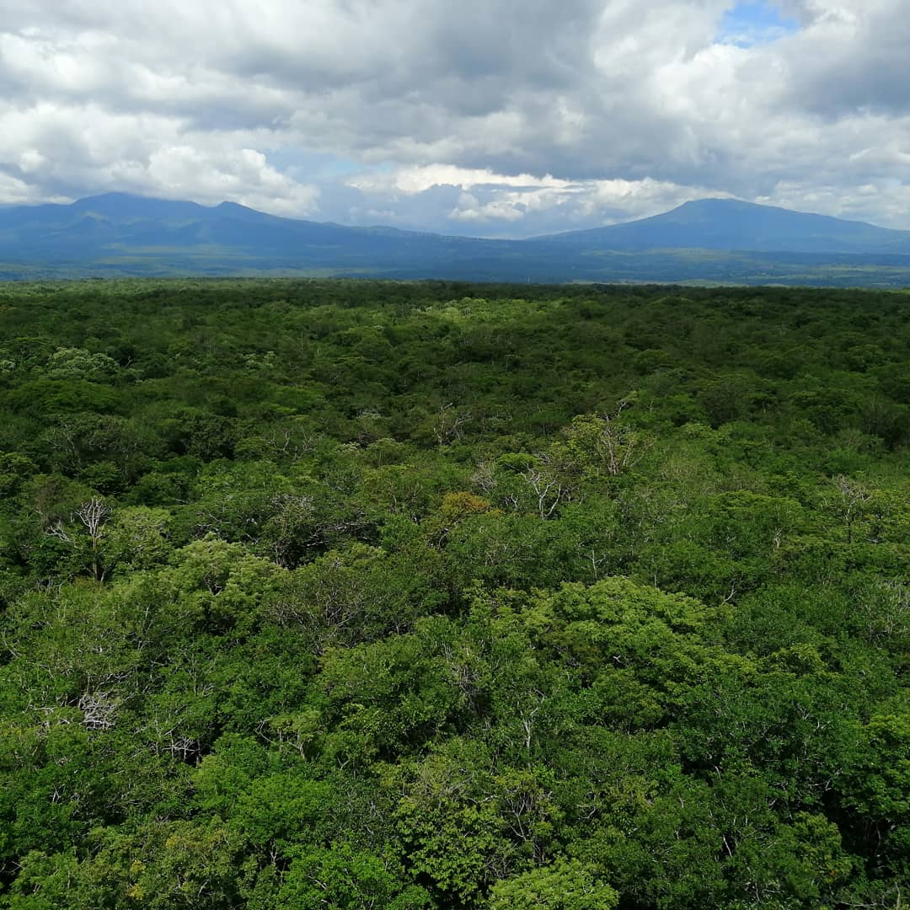

```{r setup, include=FALSE}
knitr::opts_chunk$set(echo = FALSE)

# Learn more about creating websites with Distill at:
# https://rstudio.github.io/distill/website.html

```

```{r fig.cap = "View from the Flux Tower in Santa Rosa National Park, Costa Rica", out.extra = "class=external", layout="l-body-outset"}

```

<!-- 1. Home (~200 words) -->

<!-- Title – Aim for a short, descriptive and catchy title. This could be your main  -->
<!-- research question, e.g. “Does clearcutting really affect tree density?” or your -->
<!-- main finding: “Cearcutting reduces tree density to zero”. Avoid uninformative  -->
<!-- titles such as “The effect of this … on that …”. -->


<!-- Summary – In plain words, describe what you want to accomplish with your study.  -->
<!-- Two or three sentences why your objective/question is important. Two or three  -->
<!-- sentences about your research approach: summarize your sampling procedure/experimental design/analysis. Two or three sentences about your results: describe your main -->
<!-- findings in a concise and quantitative way (I observed a 20% decrease of tree  -->
<!-- density under the 1/5th harvesting treatment). End with your main conclusion. -->

## Summary of the project

Photosynthesis by terrestrial vegetation is the primary driver of many 
biogeochemical cycles on Earth. Quantifying photosynthesis and thus the 
amount of carbon fixed (Gross Primary Production) is essential to understand 
the ecosystems health, global change, biodiversity and agriculture.

The principal method to estimate GPP is Eddy Covariance technique which is a
method in-situ which have an spatial constrain. Satellite remote sensing techniques
can overcome spatial constrain but uncertainties are higher.

This research evaluates the estimations of GPP obtained from the Moderate 
Resolution Imaging Spectroradiometer (MODIS) with GPP estimations obtained through
Eddy Covariance technique in a tropical dry forest in Santa Rosa National Park,
Costa Rica.

Trends of GPP obtained from MODIS variate with trends of GPP obtained in-situ
for the period from 2013 to 2016. Meteorological variables can influence the
photosynthetic response without affecting at early stages of the dry season the
canopy structure, which cannot be capture by spectral data.


<!-- Visual Elements – Use a photo or another visual element that represents your  -->
<!-- research topic. -->

```{r fig.cap = "View from the Flux Tower in Santa Rosa National Park, Costa Rica", out.extra = "class=external", layout="l-body-outset"}
knitr::include_graphics("img/IMG-20190908-WA0049.jpg")
```
