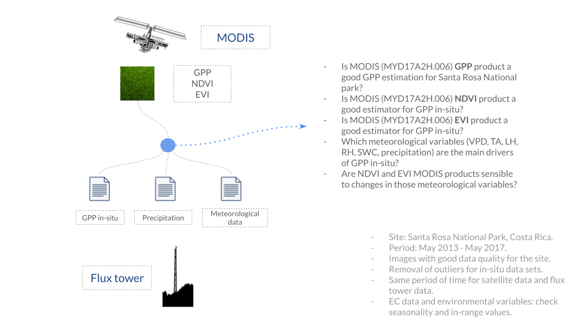

```{r setup, include=FALSE}
knitr::opts_chunk$set(echo = FALSE)

## Libraries
library(leaflet)
```

<!-- 3. Methods (~200 words) -->

<!-- Data collection – Briefly describe your sampling procedure/experimental  -->
<!-- design/measurement protocols. How did you select a sample from a population in -->
<!-- a way that allows you to generalize? Please only describe the data that you  -->
<!-- actually analyze as part of this course project, not other things you have done  -->
<!-- as part of your thesis! -->

## Data

### Santa Rosa National Park

Data collected comes from an Eddy covariance system and a meteorological station
that has been monitoring on the site since from 2013. Data used in this research
have been published on the [Hardvard Dataverse repository](https://dataverse.harvard.edu/dataset.xhtml?persistentId=doi:10.7910/DVN/P1PTYB). 

During the period of analysis (from 2013 to 2017) El Niño-Southern Oscillation 
was experimented, with an impact of reducing the precipitation for 2014 and 
2015. (Castro _et al._ 2018).

GPP values for the site are available at monthly basis (mean oer month). GPP
estimation was done using a light-response curve (Castro _et al._ 2018) Also, 
environmental values from the site that were used for this research are: 

 - Vapor Pressure Deficit (VPA)
 - Air Temperature (TA)
 - Latent Heat (LH)
 - Relative humidity (RH)
 - Soil Water Content (SWC).

These data files are shown and explained in the 
[Data Exploration](https://ronnyhdez.github.io/gpp_remote_sensing/eda.html#srnp-data-exploration)
section.

### Satellite data

The second source of data was the satellite derived products from Moderate 
Resolution Imaging Spectroradiometer (MODIS) (Didan, K. 2015). Specifically
the MODIS/Terra Gross Primary Productivity 8-Day L4 (MYD17A2H-006) product was
used for GPP values and the MODIS/Terra Vegetation Indices 16-Day L3 (MOD13Q1-006)
to obtain NDVI and EVI values. A pixel that matched the flux tower position in 
Santa Rosa National Park was selected to ensure that the flux footprint 
climatology lies within this area.

<!-- TODO: EXPLAIN GPP MODEL FROM MODIS AND INDICES CHARACTERISTICS -->

## Analysis

I want to validate remotely sensed estimates of GPP. Given the datasets available
for  this research, the following  diagram summarises the relations, steps, and
questions to achieve this:

```{r fig.cap = "Diagram of data sets origin, their relations and questions to answer.", out.extra = "class=external", layout="l-body-outset"}

```

As part of the exploratory analysis, all the environmental variables are plotted
through time to understand the seasonal patterns on the site along with the
GPP estimated in-situ, and the MODIS products (GPP, NDVI, and EVI)

An exploratory correlation was performed with `GPP ~ NDVI` and `GPP ~ EVI` values
from MODIS products to validate if there was a strong or weak relation between
these variables.

Then a comparison plot between GPP in-situ and GPP from MODIS through all the
time period was created to visually validate if the patterns were close or if
the values differed.

For models, all outliers were remove with the interquartile method assuming that
values that have an interquartile range 1.5 greater than the third quartile or 
1.5 less than the first quartile can be due to sensor errors. MODIS data was 
filtered to remove bad data quality points when flagged as such.

For more detail on the datasets please check the [data exploration section](https://ronnyhdez.github.io/gpp_remote_sensing/eda.html)

<!-- Visual Elements – These are probably most important in this section to keep your -->
<!-- reader’s attention. Avoid lengthy method descriptions, and instead use maps of  -->
<!-- your study sites, diagrams of your experimental and sampling designs, and tables -->
<!-- with design statistics, such as number of sites/blocks/reps, and transects/plots -->
<!-- within reps. Ground or aerial photos of your field sites with diagrams drawn on  -->
<!-- top of them in PowerPoint can be very effective. -->

## Site

The flux site is located northwest of Costa Rica, within the Santa Rosa National Park Environmental Super Site in Guanacaste. The site has plateaus from 300 masl and is composed of tropical dry forest in several stages of successional regeneration with an average height of 13 m. (Castro _et al._, 2018) Half of the species in the site are deciduous, with an average annual temperature of 25 °C and the total annual precipitation is between 700 and 2000 mm, with a dry season of 4 to 5 months where precipitation is less than 100 mm per month or even 0 mm (Sánchez-Azofeifa _et al._, 2005). This site was a cattle ranch for 200 years until 1970 when it was declared as a National Park (Janzen 2000) and from there a regeneration process of the forest have been going on until nowadays where we find a secondary tropical dry forest with diverse vegetation types and three stages of ecological succession: early, intermediate and late. (Kalacska _et al._, 2004; Cao & Sanchez-Azofeifa 2017) 

```{r}
sr_map <- leaflet() %>%
  addTiles() %>%  # Add default OpenStreetMap map tiles
  setView(lng = -85.6288, lat = 10.8529, zoom = 10) %>% 
  addMarkers(lng = -85.6288, lat = 10.8529, 
             popup = "Carbon Flux Tower at Santa Rosa National Park")

sr_map
```

## References

 > AppEEARS Team. (2022). Application for Extracting and Exploring Analysis Ready Samples (AppEEARS). Ver. 2.71. NASA EOSDIS Land Processes Distributed Active Archive Center (LP DAAC), USGS/Earth Resources Observation and Science (EROS) Center, Sioux Falls, South Dakota, USA. Accessed February 28, 2022. https://lpdaacsvc.cr.usgs.gov/appeears
 
 > Cao S, Sanchez-Azofeifa GA, Duran SM, Calvo-Rodriguez S (2016) Estimation of aboveground net primary productivity in secondary tropical dry forests using the Carnegie–Ames–Stanford approach (CASA) model. Environ Res Lett 11(7):075004
 
 > Castro, S. M., Sanchez-Azofeifa, G. A., & Sato, H. (2018). Effect of drought on productivity in a Costa Rican tropical dry forest. Environmental Research Letters, 13(4), 045001.
 
 > Didan, K. (2015). MOD13Q1 MODIS/Terra Vegetation Indices 16-Day L3 Global 250m SIN Grid V006. NASA EOSDIS Land Processes DAAC. Accessed 2022-02-28 from https://doi.org/10.5067/MODIS/MOD13Q1.006. Accessed February 28, 2022.
 
 > Janzen DH (2000) Costa Rica's area de Conservacion Guanacaste: A long march to survival through non-damaging biodevelopment. Biodiversity 1(2):7–20
 
 > Kalacska M, Sanchez-Azofeifa GA, Calvo-Alvarado JC, Quesada M, Rivard B, Janzen DH (2004) Species composition, similarity and diversity in three successional stages of a seasonally dry tropical forest. For Ecol Manag 200(1–3):227–247

 > Running, S., Mu, Q., Zhao, M. (2015). MYD17A2H MODIS/Aqua Gross Primary Productivity 8-Day L4 Global 500m SIN Grid V006. NASA EOSDIS Land Processes DAAC. Accessed 2022-02-28 from https://doi.org/10.5067/MODIS/MYD17A2H.006. Accessed February 28, 2022.
 
 > Sánchez‐Azofeifa, G. A., Quesada, M., Rodríguez, J. P., Nassar, J. M., Stoner, K. E., Castillo, A., ... & Cuevas‐Reyes, P. (2005). Research priorities for Neotropical dry forests 1. Biotropica: The Journal of Biology and Conservation, 37(4), 477-485.


 

